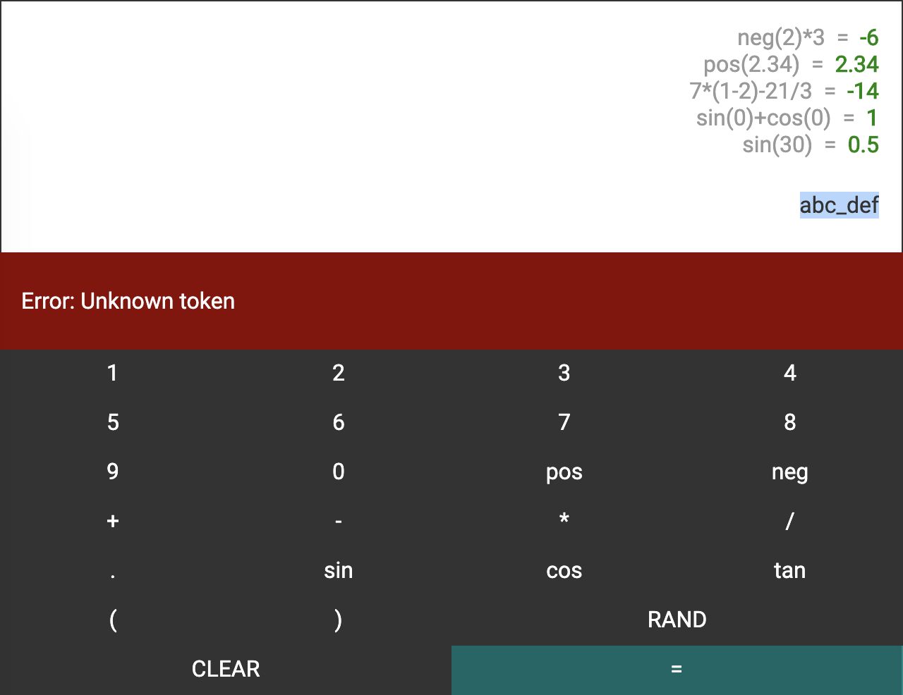

# NgxCalculator

This project was generated with [Angular CLI](https://github.com/angular/angular-cli) version 8.3.17.

To run the calculator app locally, execute `npm install && npm start` in the console and navigate to `http://localhost:4200/` in the browser.

Features:
- reads a mathematical expression and determines whether such an expression is valid (it uses regular expression to parse tokens from input string, makes conversion from infix to postfix (inverse Polish notation) and evaluates the expression),
- if the expression given by the user is invalid, an error message is displayed:
  - unknown token
  - unmatched right parenthesis
  - unmatched left parenthesis
- keeps history of previously evaluated expressions (the latest is on the top),
- 5 latest evaluations and their computed results are visible by default, scrollbar is added within the history area to scroll for older entries,
- RAND operand generates a random number between 1 and 100 and is fetched from external API server,
- layout is responsible (minimal reasonable supported device width is 320px),

Examples:
```js
neg(2)*3 = -6
pos(2.34) = 2.34
7*(1-2)-21/3 = -14
sin(0)+cos(0) = 1
sin(30) = 0.5
```

